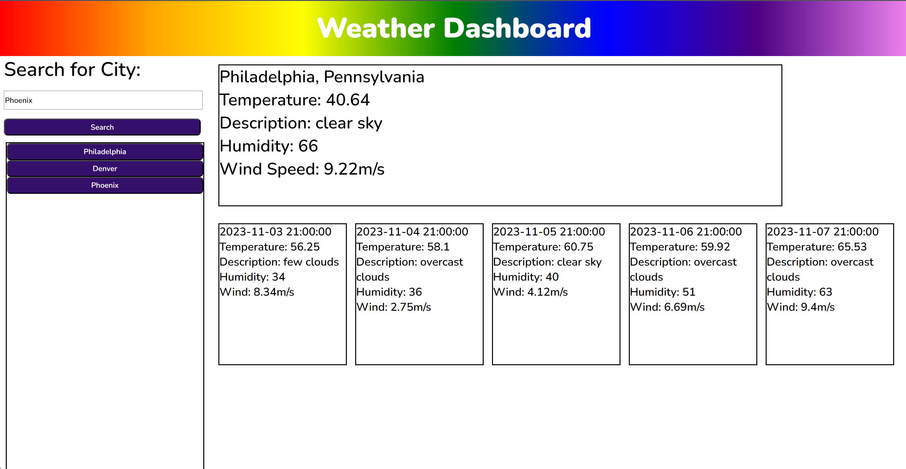

# WhatsTheWeatherLike
An application displaying a 5 day forecast of the weather of a city.

## User Story
AS A traveler
I WANT to see the weather outlook for multiple cities
SO THAT I can plan a trip accordingly

## Acceptance Criteria
GIVEN a weather dashboard with form inputs
WHEN I search for a city
THEN I am presented with current and future conditions for that city and that city is added to the search history
WHEN I view current weather conditions for that city
THEN I am presented with the city name, the date, an icon representation of weather conditions, the temperature, the humidity, and the wind speed
WHEN I view future weather conditions for that city
THEN I am presented with a 5-day forecast that displays the date, an icon representation of weather conditions, the temperature, the wind speed, and the humidity
WHEN I click on a city in the search history
THEN I am again presented with current and future conditions for that city

## Notes
trouble with "for each" = https://www.youtube.com/watch?v=6Hb0qZ3PVWI
https://stackoverflow.com/questions/10757516/how-to-prevent-adding-duplicate-keys-to-a-javascript-array

Had trouble with my local storage adding to one button. Received help through ask BCS, one fix, i was putting my entire array in the buttons.
I also received helped with the boxes. Seemed to have forgot a little of css and finally used flexbox correctly. This assignment forces you to do that. 
Received help from Anthony via Slack about the APIs. 
Everything else i had trouble with i fixed myself. 
Good assignment, i liked it. 

##Links
Git Hub - https://github.com/Hannahphoto/WhatsTheWeatherLike
Deployed - https://hannahphoto.github.io/WhatsTheWeatherLike/

    
    

